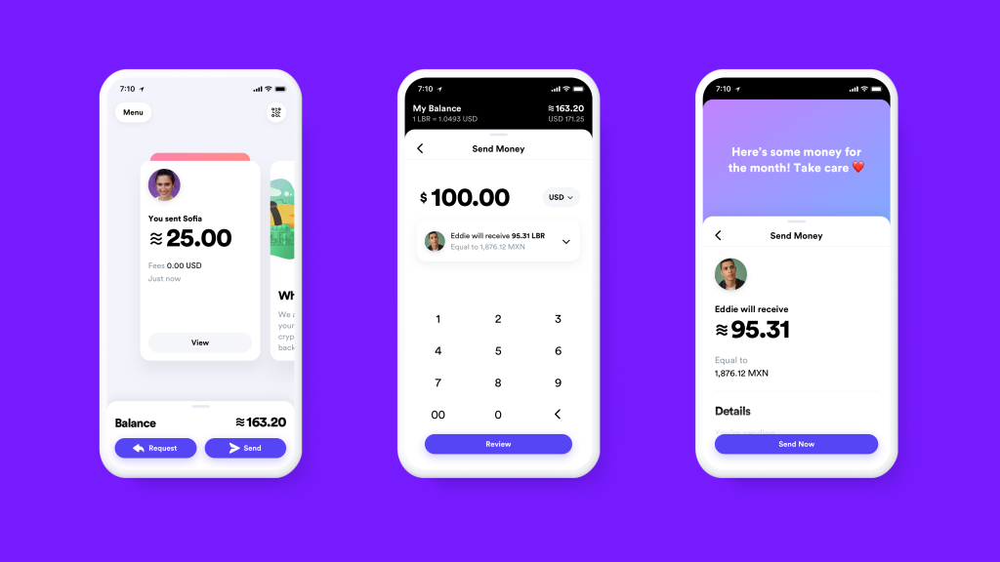

Recently Mark Zuckerberg has announced Facebook's new cryptocurrency called Libra, let's see what it is.


> Photo by [Joshua Hoehne](https://unsplash.com/photos/Uo2ZXh4XOLY) on [Unsplash](https://unsplash.com)

## Libra, the new Facebook cryptocurrency

The mission of Libra is simple and clear:
> A simple global currency and financial infrastructure that empowers billions of people.

Libra is a stable coin, meaning that, unlike Bitcoin, it doesn't have the volatility but has a reserve backed by real assets that maintain stable its value.
With Libra, Facebook is creating also an association, The Libra Association, with the purpose of regulating the growth of Libra itself. These are the 27 founding members:

>Payments: **Mastercard**, **PayPal**, **PayU (Naspers' fintech arm)**, **Stripe**, **Visa**  
>Technology and marketplaces: **Booking Holdings**, **eBay**, **Facebook/Calibra**, **Farfetch**, **Lyft**, **MercadoPago**, **Spotify AB**, **Uber Technologies, Inc.**  
>Telecommunications: **Iliad**, **Vodafone Group**  
>Blockchain: **Anchorage**, **Bison Trails**, **Coinbase, Inc.**, **Xapo Holdings Limited**  
>Venture Capital: **Andreessen Horowitz**, **Breakthrough Initiatives**, **Ribbit Capital**, **Thrive Capital**, **Union Square Ventures**  
>Nonprofit and multilateral organizations, and academic institutions: **Creative Destruction Lab**, **Kiva**, **Mercy Corps**, **Women's World Banking**

Facebook will try to extend this list to a total of 100 members before Libra's release, planned in the middle of 2020.

## How do I start with the Libra Network

The Libra Network is based on smart contracts, like Ethereum and uses a Byzantine Fault Tolerant (BFT) proof of stake, the one that NEO [uses](https://docs.neo.org/it-it/node/whitepaper.html).
[Here](https://blog.daudr.me/libra-simple-smart-contract) you will find a simple guide that illustrates how to start your local testnet and familiarise with the Libra Network.

## The Move programming language

Alongside Libra a new programming language will be released: Move.
>This programming language will let developers implement custom "smart contracts" for this new ecosystem.  
>There are two important building blocks that will appear in almost any transaction script: the LibraAccount.T and LibraCoin.T resource types. LibraAccount is the name of the module, and T is the name of a resource declared by that module. This is a common naming convention in Move; the "main" type declared by a module is typically named T.

This is an example from the [Move website](https://developers.libra.org/docs/move-overview#writing-transaction-scripts):

```javascript
// Simple peer-peer payment example.

// Use LibraAccount module published on the blockchain at account address
// 0x0...0 (with 64 zeroes). 0x0 is shorthand that the IR pads out to
// 256 bits (64 digits) by adding leading zeroes.
import 0x0.LibraAccount;
import 0x0.LibraCoin;
main(payee: address, amount: u64) {
  // The bytecode (and consequently, the IR) has typed locals.  The scope of
  // each local is the entire procedure. All local variable declarations must
  // be at the beginning of the procedure. Declaration and initialization of
  // variables are separate operations, but the bytecode verifier will prevent
  // any attempt to use an uninitialized variable.
  let coin: R#LibraCoin.T;
  // The R# part of the type above is one of two *kind annotation* R# and V#
  // (shorthand for "Resource" and "unrestricted Value"). These annotations
  // must match the kind of the type declaration (e.g., does the LibraCoin
  // module declare `resource T` or `struct T`?).

  // Acquire a LibraCoin.T resource with value `amount` from the sender's
  // account.  This will fail if the sender's balance is less than `amount`.
  coin = LibraAccount.withdraw_from_sender(move(amount));
  // Move the LibraCoin.T resource into the account of `payee`. If there is no
  // account at the address `payee`, this step will fail
  LibraAccount.deposit(move(payee), move(coin));

  // Every procedure must end in a `return`. The IR compiler is very literal:
  // it directly translates the source it is given. It will not do fancy
  // things like inserting missing `return`s.
  return;
}
```

## The Libra Association

The Libra Association will be based in Geneva, Switzerland (considered by Libra founding members a neutral state, the ideal for this new "neutral" stable coin).

>The Libra Association is an independent, Swiss not-for-profit organization with the mission to empower billions of people through the creation of a simple global currency and financial infrastructure. The association membership is made up of the validator nodes of the Libra network. Initially, these are global companies, social impact partners (SIPs), and academic institutions — the Libra Association's Founding Members. Eventually, the association will include any entity that operates a validator node and holds sufficient stake in Libra.

## Calibra: The Libra wallet

Facebook is also creating a wallet for Libra, called Calibra.



Calibra is a
>Facebook subsidiary whose goal is to provide financial services that will let people access and participate in the Libra Network

Calibra is still in its early development stage, its release is planned in 2020, so the real experience can change a lot from now on, but as we can read from the [Facebook announcement](https://newsroom.fb.com/news/2019/06/coming-in-2020-calibra/):
>From the beginning, Calibra will let you send Libra to almost anyone with a smartphone, as easily and instantly as you might send a text message and at low to no cost. And, in time, we hope to offer additional services for people and businesses, like paying bills with the push of a button, buying a cup of coffee with the scan of a code or riding your local public transit without needing to carry cash or a metro pass
