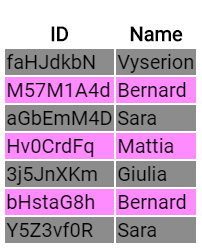
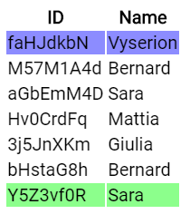
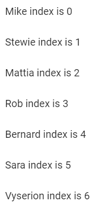

When dealing with lists in templates, ngFor saves us a lot of time, but it could be a real pain if used wrong, read this article to know hot use it right.


> Photo by [Kolleen Gladden](https://unsplash.com/photos/ij5_qCBpIVY) on [Unsplash](https://unsplash.com)

All the informations on this article can also be found in the official [docs](https://angular.io/api/common/NgForOf)

## Prerequisites

During this guide we will use an interface that represents our lists' object, let's call it `Item`, that'll look something like this:

```typescript
export interface Item {
  _id: string
  name: string
}
```

and we will use some `utils` mock and functions that'll help us later:

```typescript
export const items: Item[] = [{ _id: "a2fHdS8P", name: "Mike" }]

export const makeRandomId = (): string => {
  let result = ""
  const characters =
    "ABCDEFGHIJKLMNOPQRSTUVWXYZabcdefghijklmnopqrstuvwxyz0123456789"
  const charactersLength: number = characters.length
  for (let i = 0; i < 8; i++) {
    result += characters.charAt(Math.floor(Math.random() * charactersLength))
  }
  return result
}

export const makeRandomName = (): string => {
  const names = [
    "Sara",
    "Mattia",
    ...
  ]

  return names[Math.floor(Math.random() * names.length)]
}

export const itemsLong: Item[] = [
  {
    _id: makeRandomId(),
    name: makeRandomName(),
  },
  {
    _id: makeRandomId(),
    name: makeRandomName(),
  },
  ...
]
```

## First of all trackBy

`trackBy` is a function that defines how to track changes for items in the iterable. That means that we can use it to know exactly which element in a list are being changed, after a network call or whatsoever.
We implement it by defining a function in our `.ts` file:

```typescript
trackByFunction (index, item) {
  return item._id;
}
```

then in your `.html` add your new function

```html
<div *ngFor="let item of items; trackBy: trackByFunction"></div>
```

Doing this lets your app be more performant as it doesn't need to reload all of your view but only the element that's being changed.

## even and odd comes next

The variables `even` and `odd` are mainly used for styling the components.
For example, when we have a table and we want to make it more readable we can use these variables to change the background color of the rows.

In your `html`

```html
<table>
  <thead>
    <tr>
      <th>ID</th>
      <th>Name</th>
    </tr>
  </thead>
  <tbody>
    <tr
      *ngFor="let item of items; trackBy: trackBy; odd as odd; even as even"
      [ngClass]="{ 'odd': odd, 'even': even }"
    >
      <td>{{ item._id }}</td>
      <td>{{ item.name }}</td>
    </tr>
  </tbody>
</table>
```

And in your `css`/`scss` file

```scss
.odd {
  background-color: rgba(255, 0, 255, 0.45);
}

.even {
  background-color: rgba(0, 0, 0, 0.45);
}
```

The result will be something like


## Tell me about first and last

Just like `even` and `odd`, `first` and `last` variables are used for styling purposes too.
Let's use the already created table and set the classes only for the first and last row:

```html
<table>
  <thead>
    <tr>
      <th>ID</th>
      <th>Name</th>
    </tr>
  </thead>
  <tbody>
    <tr
      *ngFor="let item of items; trackBy: trackBy; first as first; last as last"
      [ngClass]="{ 'first': first, 'last': last }"
    >
      <td>{{ item._id }}</td>
      <td>{{ item.name }}</td>
    </tr>
  </tbody>
</table>
```

```scss
.first {
  background-color: rgba(0, 0, 255, 0.45);
}

.last {
  background-color: rgba(0, 255, 0, 0.45);
}
```

That'll look like this


## Don't forget the index

The `index` property does exactly what you think it does, it tells the index of the element in a list.
Maybe it's the property that's being used the most when we are dealing with lists, just think if you want to lay your lists' element in defined rows using `css`.

```html
<mat-list>
  <mat-list-item *ngFor="let item of items; trackBy: trackByFunction; index as index">{{ item.name }} index is {{ index }}</mat-list-item>
</mat-list>
```



All the code used in this guide can be found on [Stackblitz](https://stackblitz.com/edit/ngfor-done-right) and [GitHub](https://github.com/Daudr/ngfor-done-right)
